# Notes of the projects.

# 01 - Drum Kit.
Key Event Listener, audio play and toggle class.


## Bind an event to our keys when they are pressed.

`window.addEventListener('keydown', playSound)`

- `playSound()` is a listener for `keydown` events registered using `window.addEventListener`.
- `window` is the global object in a browser, or the root object of the DOM. And  `document` stands for DOM.

### `data-key` has its own value on `<div>`s and `<audio>`s in HTML

```
const audio = document.querySelector(`audio[data-key="${e.keyCode}"]`);
const key = document.querySelector(`div[data-key="${e.keyCode}"]`);
```

- `keyCode` property is the *KEY* to connect our buttons(`<div>`s) and sounds(`<audio>`s).
- `keyCode` 's value is same as `ASCII` code (in lowercase letter ), check keycodes [here](http://keycode.info/).
- NOTE: `keyCode` is DEPRECATED. I'll update this in the future.
- `data-key` is set for mapping buttons and audios to get the `keyCode`s via `keydown` event.
- the whole `querySelector` expression has to be in back ticks (```).
- `${}` is syntactic sugar for template literals, read more about `Expression interpolation` [here](https://developer.mozilla.org/en-US/docs/Web/JavaScript/Reference/Template_literals)

### About playing sounds

How do we prevent delay playing sound, if we keep hitting a key?

just add `audio.currentTime = 0;` before `audio.play();`

### Toggling styles

- use `item.classList.add('className')` to add class when key pressed. (same as `element.addClass('className')` in jQuery)

- use `transitionend` event to remove `play` class. since we want to just remove `transform` property, so add a condition to skip others.

```
if(e.propertyName != 'transform') return;
this.classList.remove('playing'); // `event.target.classList.remove('playing');`
```

### forEach and Arrow function

- `items.forEach()` instead of just `forEach`, which means it's a property of an array.

- Arrow functions is ES6 syntax,

```
keys.forEach(key => key.addEventListener());
```

# 02 - Javascript + CSS Clock.
pointers rotate animation, get times, changing pointer positions.


### Initialize pointer positions and rotation along the x-axis

`transform-origin: 100%; // transform-origin: right;`

`transition-timing-function: cubic-bezier();`

- `transform-origin` moves the origin of rotation along x-axis. check it [here](https://developer.mozilla.org/en-US/docs/Web/CSS/transform-origin).

- `transition-timing-function` here is for the real clock **tic-tock**-like effect.

### Get time

`setInterval(setDate, 1000);`

- the `setInterval` function runs a function passed to it every interval specified which to implement the second pointer's rotating effect.

- create `Date()` to get `now.getSeconds()`, `now.getMinutes()` and `now.getHours()`.

- culculating angles of pointers

`const secondDegrees = ((seconds / 60) * 360) + 90;`

(the initial state of pointers are 90 degrees)

### Wait...is that a glitch!?

Due to there is a glitch that occurs at every 0th second and our transition is set at 0.05s. When hand transition from final state to initial state, because the number of degrees reduce, the hand makes a (reverse) anti-clockwise motion to reach the 0 degree mark, so we'll see it occurs.

To bypass it, we remove the `transition` property at the specified degrees (where glitch occurs) via JavaScript.

```
if (secondsDegrees === 90) secondHand.style.transition = 'all 0s';
else secondHand.style.transition = 'all 0.05s';

if (minsDegrees === 90) minHand.style.transition = 'all 0s';
else minHand.style.transition = 'all 0.1s';
```

# 03 - CSS Variables and JavaScript.
`data-` attribute, `:root`, CSS Variables definition `var(--xxx)`, `filter: blur()`, `change` event and `mousemove` event


- [`dataset`](https://developer.mozilla.org/zh-TW/docs/Web/API/HTMLElement/dataset) property allows to custom data attributes like `data-xxx` on the element, either in HTML or in the DOM. It's a map of **DOMString**, one entry for each custom data attribute.

- `:root` selector matches the document's root element is always the html element and it's also where we declare the variable for the base element in HTML.

- once we declare CSS Variables, then we can add it to our specific elements, like `img` below, check how to declare it [here](https://developer.mozilla.org/en-US/docs/Web/CSS/Using_CSS_variables).

- CSS Variable declare syntax is `--`, just like `$` in SASS.

```
:root {
  --spacing: 10px;
}

img {
  padding: var(--spacing);
}
```

- CSS `filter` provides such as `blur`, `bightness` and so on, take a look at it [here](https://developer.mozilla.org/en-US/docs/Web/CSS/filter).

- NodeList v.s. Array : NodeList is **NOT** an Array. You can open the `proto` in dev tool and  see its methods, there are `forEach()`, `keys()`..., and Array's prototype has `map()`, `pop()`...etc.

### Handling suffix with dataset

use `dataset` to deal with suffix `px` by adding `data-sizing: px` as an attribute on input element.

```
<input type="range" name="blur" min="0" max="25" value="10" data-sizing="px">
```

and the get the suffix by `dataset.sizing` via JS

```
const suffix = this.dataset.sizing || '';
```

and don't forget a condition with `|| ''` for `<input type=color>` which has no `px`.

### Changing CSS property via JS

`document.documentElement` is the root element in JS, so we can change the global CSS variables by JS is just `setProperty` to `style` like so:

```
document.documentElement.style.setProperty('--base', '#000');
```

# 04 - Array cardio 1.
`console.table()`, `filter()`, `map()`, `sort()`, `reduce()`


### filter

[`Array.prototype.filter()`](https://developer.mozilla.org/en-US/docs/Web/JavaScript/Reference/Global_Objects/Array/filter) creates a new array with all elements that pass the test implemented by the provided function.

- here I learned a compact way to return a value instead of an if-statement returning `true`.

```
const fifteens = inventors.filter(inventor => (inventor.year >= 1500 && inventor.year < 1600));
```

- and I also learned about `console.table()` instead of `console.log()` to display result pretty.

### map

[`Array.prototype.map()`](https://developer.mozilla.org/en-US/docs/Web/JavaScript/Reference/Global_Objects/Array/map) creates a new array with the results of calling a provided function on every element in this array. (takes in an array, and modifies it and returns a new array)

- use `+` for concatenation in JS.

```
const fullNames = inventors.map(inventor => inventor.first + ' ' + inventor.last);
```

above code in a ES6 syntax way:

```
const fullNames = inventors.map(inventor => `${inventor.first} ${inventor.last}`);
```

see, you don't event need to use `+` for concatenation!

### sort

[`Array.prototype.sort()`](https://developer.mozilla.org/en-US/docs/Web/JavaScript/Reference/Global_Objects/Array/sort) sorts the elements of an array *in place* and returns the array.

- the default sort order is according to string Unicode code points.

- `sort()` also accepts the specific function that defines the sort order.

```
const ordered = inventors.sort((a, b) => (a.year > b.year) ? 1 : -1);
```

in this case, we can also write it more shortly for an **ascending order** just like:

```
const ordered = inventors.sort((a, b) => a.year - b.year);
```

### combination of filter and map

```
const de = links
           .map(link => link.textContent)
           .filter(streetName => streetName.includes('de'));
```
- **[NOTICE]**: since `nodeList` is **NOT** an `array`, so we need to turn it into an array first for manipulate array methods.

```
const links = Array.from(document.querySelectorAll('.mw-category a'));
```

above code can rewrite into ES6 syntax like:

```
const links = [...(document.querySelectorAll('.mw-category a'))];
```

### reduce

[`Array.prototype.reduce()`](https://developer.mozilla.org/en-US/docs/Web/JavaScript/Reference/Global_Objects/Array/Reduce) method applies a function against an accumulator and each value of the array(from left-to-right) to reduce it to a single value.

```
const transportation = data.reduce(function(obj, item) {
  if(!obj[item]) {
    obj[item] = 0;
  }
  obj[item] ++;
  return obj;
}, {});
```

`obj` is an element passed in to the `reduce()` function which will gather data over each iteration. and the result is just reduced the "numbers" collection into the "total" variables. which means every time you find yourself going from a list of values to one value (reducing), then you can use this method.

```
const sum = [0, 1, 2, 3, 4].reduce((a, b) => a + b, 0);

console.log(sum);  // 10
```

# 05 - Flex Panels Image Gallery
CSS `flex`, `toggle()`, `includes()`, `transitionend`


### CSS flex

[CSS Flexible box layout](https://developer.mozilla.org/en-US/docs/Web/CSS/CSS_Flexible_Box_Layout)

there are bunch of articles about CSS flexbox layout, and I hightly recommend [this one](https://css-tricks.com/snippets/css/a-guide-to-flexbox/) written by [Chris Coyier](https://github.com/chriscoyier) on CSS-Tricks if you are new to this fearture.

### includes()

> Safari transitionend event.propertyName === flex */
>
> Chrome + FF transitionend event.propertyName === flex-grow */

due to there are different words between browsers, so we use `.includes()` to find the key word `'flex'` here, for matches them.

```
if (e.propertyName.includes('flex')) {
  this.classList.toggle('open-active');
}
```

# 06 - Ajax Type Ahead
- `change` & `keyup` events
- Promise: `fetch()`, `then()`, `json()`
- Array: `filter()`, `map()`, `push()`, `join()`
- Regexp: `match()`, `replace()`


### `change` & `keyup` events

`change` can also be an event in `addEventListener` for inputs, but the `change` only fires when we step outside that input. so we need to tie the element up with the `keyup` event as well. for better user experience.

```
searchInput.addEventListener('change', displayMatches);
searchInput.addEventListener('keyup', displayMatches);
```

### Fetch API

[Fetch API](https://developer.mozilla.org/en-US/docs/Web/API/Fetch_API) provides an interface for fetching resources(including across the network). It will seem familiar to anyone who has used [XMLHttpRequest](https://developer.mozilla.org/en-US/docs/Web/API/XMLHttpRequest), but the new API provides a more powerful and flexible feature set.

[fetch()](https://developer.mozilla.org/en-US/docs/Web/API/WindowOrWorkerGlobalScope/fetch) is one of GlobalFetch API method used to start the process of fetching a resource.

```
fetch(input, init).then(function(response) {...});
```

in [MDN's basic fetch example](https://developer.mozilla.org/en-US/docs/Web/API/GlobalFetch)(see `Examples` section) like:

```
var myImage = document.querySelector('.my-image');

fetch('flowers.jpg')
  .then(function(response) {
    if (!response.ok) return new Error(response);
    return response.blob();
  })
  .then(function(myBlob) {
    var objectURL = URL.createObjectURL(myBlob);
    myImage.src = objectURL;
  })
```

in ES6 syntax will be like:

```
const myImage = document.querySelector('img');

fetch('flowers.jpg')
  .then(response => response.blob())
  .then(myBlob => {
    const objectURL = URL.createObjectURL(myblob);
    myImage.src = objectURL;
  });
```

above example shows that it use the `blob()` to fetch image. and there are many other ways as well. we use `json()` it this case.


### ES6 Spread syntax

[Spread syntax](https://developer.mozilla.org/en-US/docs/Web/JavaScript/Reference/Operators/Spread_operator) allows an expression to be expanded in places where multiple arguments(for function calls) or multiple elements(for array literals) or multiple variables(for destructing assignment) are expected.

For function calls:

```
myFunction(...iterableObj);
```

For array literals:

```
[...iterableObj, 4, 5, 6]
```

usually, we use [`Function.prototype.apply`](https://developer.mozilla.org/en-US/docs/Web/JavaScript/Reference/Global_Objects/Function/apply) in cases like:

```
function myFunction(x, y, z) {}
var args = [0, 1, 2];
myFunction.apply(null, args);
```

but in ES6 we can now write the above as:

```
function myFunction(x, y, z) {}
var args = [0, 1, 2];
myFunction(...args);
```

### RegExp

```
const regex = new RegExp(wordToMatch, 'gi');
```

`g` is for **global** and `i` is for **case insensitive**,
  `wordToMatch` is our variable, then do `element.match(regex)` or `element.replace(regex)`.

in RegExp, the `match()` executes for matching what we search, and then combine with `Array.filter()` so that we can filter out all the results that we expect.

# 07 - Array Cardio 2
`Array.prototype.some()`, `Array.prototype.every()`, `Array.prototype.find()`, `Array.prototype.findIndex()`, `Array.prototype.splice()`, `Array.prototype.slice()`


### `Array.prototype.some()`

The [`some()`](https://developer.mozilla.org/en-US/docs/Web/JavaScript/Reference/Global_Objects/Array/some) method tests whether some element in the array passes the test implemented by the provided function. which means that it checks at least one thing in the array matches something. just like `OR` operation.

```
const isAdult = people.some(function(person) {
  const currentYear = (new Date()).getFullYear();
  if (currentYear - person.year >= 19) {
    return true;
  }
});
```

rewrite above in ES6 syntax:

```
const isAdult = people.some(person => (new Date()).getFullYear() - person.year >= 19);
```

- **[NOTICE]**: `getFullYear()` is a **function** of Date, not a property.

`some()` example:

```
function isBiggerThan10(e) {
  return e > 10;
}

console.log([2, 5, 8, 1, 4].some(isBiggerThan10));  // false
console.log([12, 5, 8, 1, 4].some(isBiggerThan10)); // true
```

### `Array.prototype.every()`

The [`every()`](https://developer.mozilla.org/en-US/docs/Web/JavaScript/Reference/Global_Objects/Array/every) method tests whether all elements in the array pass the test implemented by the provided function. like `AND` operation.

```
const everyAdult = people.every(person => (new Date()).getFullYear() - person.year >= 19);
```

`every()` example:

```
function isBigEnough(e) {
  return e >= 10;
}

console.log([12, 5, 8, 130, 44].every(isBigEnough));   // false
console.log([12, 54, 18, 130, 44].every(isBigEnough)); // true
```

### `console.log(allAdult)` VS. `console.log({allAdult})`

```
console.log(allAdult)    // gives the value of allAdult variable
console.log({allAdult})  // gives the allAdult object itself
```


### `Array.prototype.find()`

The [`find()`](https://developer.mozilla.org/en-US/docs/Web/JavaScript/Reference/Global_Objects/Array/find) method returns a value of the **first** element in the array that satisfies the provided testing function. Otherwise `undefined` is returned.

`find()` is like filter but instead of returning a subset of the array it returns the first item it finds (or `undefined`).

```
const comment = comments.find(comment => comment.id == 823423);
```

`find()` example:

```
function isBigEnough(e) {
  return e >= 15;
}

[12, 5, 8, 130, 44].find(isBigEnough);  // 130
```

### `Array.prototype.findIndex()`

The [`findIndex()`](https://developer.mozilla.org/en-US/docs/Web/JavaScript/Reference/Global_Objects/Array/findIndex) method returns an **index** of the first element in the array that satisfies the provided testing function. Otherwise `-1` is returned.

```
const index = comments.findIndex(comment => comment.id == 823423);
```

`findIndex()` example:

```
function isBigEnough(e) {
  return e >= 15;
};
[12, 5, 8, 130, 44].findIndex(isBigEnough);  // 3 (the value 130's index of the array is 3)
```

- `find()` and `findIndex()` are the new features of ES6

### `Array.prototype.splice()`

The [`splice()`](https://developer.mozilla.org/en-US/docs/Web/JavaScript/Reference/Global_Objects/Array/splice) method changes the content of an array by removing existing elements and/or adding new elements.

```
comments.splice(index, 1); // will change content of the origin array
```

`splice()` syntax:

```
array.splice(start)
array.splice(start, deleteCount)
array.splice(start, deleteCount, item1, item2, ...)
```

- `start`: index at which to start changing the array (with origin 0)
  - if greater than the length of the array, actual starting index will be set to the length of the array.
  - if negative, will begin that many elements from the end of the array.
- `deleteCount`: an integer indicating the number of old array elements to remove.
  - if deleteCount is 0, no elements are removed. in this case, you should specify at least one new element.
  - if deleteCount is omitted, deleteCount will be equal to (arr.length - start)
- `item1, item2, ...`: the elements to add to the array, beginning at the start index. If you don't specify any elements, splice() will only remove elements from the array.

now let's try it

- `slice()` starts from `index = 2`, `deleteCount = 0` and add new element `15`

```
var nums = [0, 1, 2, 3, 4, 5];
nums.splice(2,0,15);
console.log(nums);   // [0, 1, 15, 2, 3, 4, 5]
```

- `slice()` starts from `index = 2`, `deleteCount = 2` and add new element `15`

```
var nums = [0, 1, 2, 3, 4, 5];
nums.splice(2,2,15);
console.log(nums);   // [0, 1, 15, 4, 5]
```

### `Array.prototype.slice()`

The [`slice()`](https://developer.mozilla.org/en-US/docs/Web/JavaScript/Reference/Global_Objects/Array/slice) method returns shallow copy of a protion of an array into a new array object selected from begin to end (**end NOT included**). The original array will not be modified.

```
const newComments = [
  ...comments.slice(0, index),
  ...comments.slice(index + 1)
];
```
in above `...` is the ES6 [spread syntax](https://developer.mozilla.org/en-US/docs/Web/JavaScript/Reference/Operators/Spread_operator)

let's take a look those two `...comments.slice()` above, what do we get for our `newComments` array:

- now we know that the `index = 1` which is the element we want to delete.


`slice()` syntax:

```
arr.slice()
arr.slice(begin)
arr.slice(begin, end)
```

- `begin` (optional): zero-based index at which to begin extraction.
  - as a negative index, begin indicates an offset from the end of the sequence.
    - `slice(-2)` extracts the last two elements in the sequence.
  - if begin is undefined, slice begins from index 0.
- `end` (optional): zero-based index at which to end extraction. slice extracts up to but **NOT including end**.
  - `slice(1,4)` extracts the second element through the fourth element (elements indexed 1, 2, and 3).
  - as a negative index, end indicates an offset from the end of the sequence.
    - `slice(2,-1)` extracts the third element through the second-to-last element in the sequence.
  - if end is omitted, slice extracts through the end of the sequence (arr.length).
- returns a new array containing the extracted elements.

now let's try it

```
var nums = [0, 1, 2, 3, 4, 5];
var newNums = nums.slice(2,4);
console.log(nums);     // [0, 1, 2, 3, 4, 5]
console.log(newNums);  // [2, 3]
```

results in our tutorial:


# 08 - HTML5 Canvas
Canvas, HSL, mouse events


### Canvas

[`Canvas`](https://developer.mozilla.org/en-US/docs/Web/API/Canvas_API) is added in HTML5, the HTML `<canvas>` element can be used to draw graphics via scripting in JavaScript. It's also used by WebGL to draw hardware-accelerated 3D.

- Implementing basic Canvas

  - in HTML

    ```
    <canvas id="draw" width="800" height="800"></canvas>
    ```

  - in JavaScript

    ```
    var canvas = document.getElementById('canvas');
    var ctx = canvas.getContext('2d');
    ```

in our tutorial we use these:

- Properties
  - `ctx.lineCap`: the shape of the stroke, `round` | `butt` | `square`.
  - `ctx.lineJoin`: determines how two connecting segments (of lines, arcs or curves) with non-zero lengths in a shape are joined together), `bevel` | `round` | `miter`.
  - `ctx.lineWidth`: sets the thickness of lines in space units.
  - `ctx.strokeStyle`: specifies the color or style to use for the lines around shapes. The default is `#000` (black).
  - `ctx.fillStyle`: specifies the color or style to use inside shapes. The default is `#000` (black).

- Methods
  - `ctx.beginPath()`: starts a new path by emptying the list of sub-paths. Call this method when you want to create a new path.
  - `ctx.stroke()`: strokes the current or given path with the current stroke style using the non-zero winding rule.
  -`ctx.moveTo()`: moves the starting point of a new sub-path to the (x, y) coordinates.
  -`ctx.lineTo()`: connects the last point in the sub-path to the x, y coordinates with a straight line(but does not actually draw it).

### HSL

[mothereffinghsl.com](http://mothereffinghsl.com/) website shows you the figure of HSL.
The [HSL](https://developer.mozilla.org/en-US/docs/Web/CSS/color_value)(seel the "hsl()" section) is the Hue-saturation-lightness model using the `hsl()` function notation.

- H (hue): is represented as an angle of the color circle.
  - value `0~360`
  - red = 0 = 360
  - green = 120
  - blue = 240
- S (saturation): represented as percentages.
  - value `0~1` or percentages
  - 100% is full saturation
  - 0% is a shade of grey
- L (lightness): represented as percentages.
  - value `0~1` or percentages
  - 100% lightness is white
  - 0% lightness is black
  - 50% lightness is "normal"

```
hsl(0,  100%,50%)    /* red  */
hsl(120,100%,50%)    /* green */
hsl(240,100%,50%)    /* blue */
```

The advantage of HSL over RGB is that it is far more intuitive: you can guess at the colors you want, and then tweak. It is also easier to create sets of matching colors (by keeping the hue the same and varying the lightness/darkness, and saturation).

in our tutorial
- how to implement a rainbow-like gredient color?

```
ctx.strokeStyle = `hsl(${hue}, 100%, 50%)`;
hue++;
if (hue >= 360) {
  hue = 0;
}
```

↑↑↑ just to restore its value when it is more than 360 to 0 to re-accumulate.

### Dealing with Drawing

- register eventListeners

```
let isDrawing = false;

canvas.addEventListener('mousedown', isDrawing = true);        // ready to draw when mouse down
canvas.addEventListener('mousemove', draw);                    // drawing when mouse move
canvas.addEventListener('mouseup', () => isDrawing = false);   // stop drawing when mouse up
canvas.addEventListener('mouseout', () => isDrawing = false);  // stop drawing when mouse out of canvas
```

- defining drawing lines

```
ctx.beginPath();
// start from
ctx.moveTo(lastX, lastY);
// go to
ctx.lineTo(e.offsetX, e.offsetY);
ctx.stroke();

[lastX, lastY] = [e.offsetX, e.offsetY];
```
**[NOTICE]**: `[lastX, lastY] = [e.offsetX, e.offsetY]`
  - it must be at the bottom of "go to" section in the function, or it will have a slight problem occurs.
  - this is in the ES6 syntax to define multiple variables in one statement, it's also equals like:

    ```
    lastX = e.offsetX;
    lastY = e.offsetY;
    ```
  - ↑↑↑ this way called [destructuring assignment](https://developer.mozilla.org/en-US/docs/Web/JavaScript/Reference/Operators/Destructuring_assignment) (see "Assignment seperate from declaration" section)
  - example:

    ```
    var a, b;

    [a, b] = [1, 2];
    console.log(a); // 1
    console.log(b); // 2
    ```

- controlling line width of stroke

```
if (ctx.lineWidth >= 50 || ctx.lineWidth <= 1) {
  direction = !direction;
}

if(direction) {
  ctx.lineWidth++;
} else {
  ctx.lineWidth--;
}
```


- drawing on mobile?

try

```
// dealing with touch screen
if (e.type != "mousemove") {
  x = e.changedTouches[0].clientX;
  y = e.changedTouches[0].clientY;
}
```

# 09 - Hold Shift and Check Checkboxes (Gmail feature)


### Fetch all the `<input>` elements and `addEventListener`

```
const checkboxes = document.querySelectorAll('.inbox input[type="checkbox"]');
checkboxes.forEach(checkbox => checkbox.addEventListener( 'click', handleCheck ));  // `click` also fire when use keyboard
```

### Checking steps

- destructuring steps
  - check an input a <- will be the `lastChecked`
  - hold shift key
  - check an input b <- will be `this`
  - then we want to all the inputs between a and b will also be checked <- `inBetween`'s inputs `.checked = true`;

- after searching:

```
let lastChecked;

function handleCheck(e) {
  let inBetween = false;
  if(e.shiftKey && this.checked) {
    checkboxes.forEach(checkbox => {
      if(checkbox === this || checkbox === lastChecked) {
        inBetween = !inBetween;
      }

      if(inBetween) {
        checkbox.checked = true;
      }
    });
  }

  lastChecked = this;
}
```

 - we defines the range of `inBetween` by `checkbox === this` and `checkbox === lastChecked`

 - checking all inputs, if it's one of the two inputs we checked, then flip the `inBetween = true`, and set all the `inBetween = true` inputs ' `.checked = true`

### Where I got stuck

let's take a look in a pseudo-code way

```
let inBetween = false;
// first seleted b, then hold shiftKey and slected d
//start checking
[ ] a  <- inBetween = false, it doesn't event get in the if condition
[v] b  <- inBetween = true, b is the checked input 'lastChecked', and inBetween starts to flip to true
[v] c  <- inBetween = true
[v] d  <- inBetween = false, d is the checked input 'this', and its inBetween is fliped from true to false, then the checking ended as well.
[ ] e  <- inBetween = x, it doesn't get in the if condition
```


I've got stuck in a long time for that iteraling to the input c, how come its `inBetween` is true, seems like it doesn't match either `checkbox === this` or `checkbox === lastChecked`, is beacuse the `inBetween` had fliped to true so that it's true when checking on input c, right ?

hope this way will help you understand much better like I did.

### Let's face to some problems

- problem 1: if you reload page and hold shift key directly, then select one input, the rest of inputs those are after the one you selected will be selected too.
- problem 2: if you shift-selected input b to input d, and then you unselect the input c, then again you hold shift key and select the input c, you'll get the others after input d will be selected too.

I guess the above two problems both are the same logic issues.


The figure above shows the problem 1 result I'd tried, and I think that is because in this case only has a seleted input just right equals the `checkbox === lastChecked` and some how it treat the last input as the `checkbox === this`, so it will iteral over all the rest of inputs (after the one we seleted), and set the `inBetween = true` till the end.

### How to fix it up

Here is one of solutions I found on [stack overflow: How can I shift-select multiple checkboxes like GMail? ](http://stackoverflow.com/questions/659508/how-can-i-shift-select-multiple-checkboxes-like-gmail/659571#659571)

- step 1: turn the NodeList into an Array

```
const checkboxes = document.querySelectorAll('.inbox input[type="checkbox"]');
const checkboxesArray = [...checkboxes]; // fixup-step-1: turn the NodeList into an Array
```

- step 2: when `e.shfitKey` is true, use `array.indexOf()` to get the index of seleted inputs in the array to define the range (say the range containts the start point like `checkbox === lastChecked` and end point like `checkbox === this`)

```
let start = checkboxesArray.indexOf(lastChecked);
let end = checkboxesArray.indexOf(this);
```

- step 3: `let` the `checkState` variable is `false`, it represents the inputs in the range which are checked or not

```
let checkState = false;
```

- step 4: use `array.slice()` to take all the elements between the range and change their `checkState` to checked

```
checkboxesArray
  .slice(Math.min(start, end), Math.max(start, end) + 1)
  .forEach(input => input.checked = checkState);
```

- combine them all together

```
const checkboxes = document.querySelectorAll('.inbox input[type="checkbox"]');
const checkboxesArray = [...checkboxes]; // fixup-step-1

let checkState = false;  // fixup-step-3
function handleCheck(e) {
  if(!lastChecked) { lastChecked = this; }  // mark the lastChecked to redefine the range
  checkState = lastChecked.checked ? true : false;  // checked or unchecked

  if(e.shiftKey) {
    // fixup-step-2
    let start = checkboxesArray.indexOf(lastChecked);
    let end = checkboxesArray.indexOf(this);
    // fixup-step-4
    checkboxesArray
      .slice(Math.min(start, end), Math.max(start, end) + 1)
      .forEach(input => input.checked = checkState);

    if(start - end < 0) {
      console.log(`from first selected input ${start} to second selected input ${end} are checked`);
    } else {
      console.log(`[Backforwad]form first selected input ${start} to second selected input ${end} are checked`);
    }
  }
  lastChecked = this;
}
```


well then...now it seems much better, but I think there are some other tiny problems...
I have not updated the code yet, just tested the fix.

# 10 - Custom Video Player
`video.paused`, `video.currentTime`, `dataset` of `.data-` attribute, `parseFloat()`


### Get all the elements we need

user `.querySelector` or `.querySelectorAll` to get the elements we need to build up the panel for video player

```
const player = document.querySelector('.player');
const video = document.querySelector('.viewer');
const progress = document.querySelector('.progress');
const progressBar = document.querySelector('.progress__filled');
const toggle = document.querySelector('.toggle');
const skipButtons = document.querySelectorAll('[data-skip]');
const ranges = document.querySelectorAll('.player__slider');
```

### Build out functions

- function togglePlay()
  - click the video to play
  - `.paused` is the property of `video`

  and there is no `.playing` property live on `video`

  ```
  function togglePlay() {
    const method = video.paused ? 'play' : 'pause';
    video[method]();
  }
  ```

  above code equals to:

  ```
  video[vdeo.paused ? 'play' : 'pause']();
  ```

  and

  ```
  if(video.paused) {
    video.play();
  } else {
    video.pause();
  }
  ```

- function updateButton()
  - toggle the play button during the video plays or pauses

  to change icon, in this case is change the `textContent` property

  ```
  const icon = this.paused ? '►' : '❚ ❚';  // `this` is the `video`
  toggle.textContent = icon;
  console.log({toggle});  // log the `{toggle}` out to see where the `textContent` is
  ```

  

- function skip()
  - click the skip buttons to skip

  the two skip buttons are: `<button data-skip="-10"></button>` and `<button data-skip="25"></button>`

  ```
  console.log(this.dataset.skip);
  video.currentTime += parseFloat(this.dataset.skip);
  ```
  `console.log(this.dataset)` can get the information which is the value we just added as `data-skip` attribute on HTML like:

  

  then we use its `skip` property and `parseFloat` into a float number to `-10s` or `+25s`  the `currentTime`

- function handleRangeUpdate()
  - handle the two input sliders

  the two input sliders are: `<input type="range" name="volume">` and `<input type="range" name="playbackRate">`

  ```
  console.log(`${this.name}: ${this.value}`);
  video[this.name] = this.value;
  ```

  the `name` of `this.name` is the `volume` or `playbackRate`, just what we define the `name` attributes of the inputs on HTML

  

- function handleProgress()
  - update the progress bar when the video plays

  `percent` defines the width of `progressBa`r's `flexBasis`

  ```
  const percent = (video.currentTime / video.duration) * 100;
  progressBar.style.flexBasis = `${percent}%`;
  console.log(percent);
  ```

- function scrub(e)
  - change the progress bar width when drag or click on it

  to `console.log(e)` the `MouseEvent` out and you will find the `offsetX` which is relative to the progress `offsetWidth`, use them to calculate the `scrubTime` and then update the video's `currentTime`

  ```
  const scrubTime = (e.offsetX / progress.offsetWidth) * video.duration;
  video.currentTime = scrubTime;
  console.log(e);
  ```

### Hook up the event listeners

- click the video to play

  ```
  video.addEventListener('click', togglePlay);
  ```

- toggle the play button icon when the video plays or pauses

  ```
  video.addEventListener('play', updateButton);
  video.addEventListener('pause', updateButton);
  ```

- update the progress bar when the video plays

  ```
  video.addEventListener('timeupdate', handleProgress);
  ```

- toggle the play butotn to play or pause

  ```
  toggle.addEventListener('click', togglePlay);
  ```

- click to skip (to `-10s` or `+25s`)

  ```
  skipButtons.forEach(button => button.addEventListener('click', skip));
  ```

- handle range input sliders

  add `mousemove` event for updating real-time, rather than just when we let go of the button

  ```
  ranges.forEach(range => range.addEventListener('change', handleRangeUpdate));
  ranges.forEach(range => range.addEventListener('mousemove', handleRangeUpdate));
  ```

- change the progress bar width when we click or drag on it

  ```
  progress.addEventListener('click', scrub);
  ```

# 11 - Key Sequence Detection
`keyup`, `array.push()`, `array.join()`, `array.includes()`

### Array.prototype.join()

Let's take a one more look the `.join()`

The [`.join()`](https://developer.mozilla.org/en-US/docs/Web/JavaScript/Reference/Global_Objects/Array/join) methond joins all elements of an array (or an `array-like object`) into a string.

- syntax

  If an element is undefined or null, it is converted to the empty string.

  ```
  array.join()
  array.join(seperator)
  ```

  - `seperator` (optional): Specifies a string to separate each element of the array. Defaults to `,`.

- example

  ```
  var a = ['Wind', 'Rain', 'Fire'];
  a.join();      // 'Wind,Rain,Fire'
  a.join(', ');  // 'Wind, Rain, Fire'
  a.join(' + '); // 'Wind + Rain + Fire'
  a.join('');    // 'WindRainFire'
  a.join(' ');   // 'Wind Rain Fire'
  ```

### Combine pressed keys into an array

- we can `console.log()` the `e.key` out to see the name of key we pressed

```
console.log(e.key);
```


- then use `.push()` to combine key names into an array

```
pressed.push(e.key);
```


### Check if it  matches the `secretCode`

- it starts to push out the first one item in the array, if length is over the budget of `secretCode.length` letters

```
pressed.splice(- secretCode.length - 1, pressed.length - secretCode.length);
```


- check the array to see if pressed keys matches the `secretCode`, and then add cornify effect if matched

- `.join()` to turn the array into a string

```
if(pressed.join('').includes(secretCode)) {
  console.log('DING DING!');
}
```

# 12 - Slide In On Scroll
`window.scrollY`, `window.innerHeight`, `offsetTop`


### Debouncing

use debounce function provided to avoid performance issue, just wrap the `checkSlide` function into the `debounce()` function

```
window.addEventListener('scroll', debounce(checkSlide));
```

if we don't do debounce, then it will too much like:


### Checking images

```
function checkSlide(e) {
  sliderImages.forEach(sliderImage => {

    // half way through the image
    const slideInAt = (window.scrollY + window.innerHeight) - sliderImage.height / 2;

    // bottom of the image
    const imageBottom = sliderImage.offsetTop + sliderImage.height;

    const isHalfShown = slideInAt > sliderImage.offsetTop;
    const isNotScrolledPast = window.scrollY < imageBottom;

    if(isHalfShown && isNotScrolledPast) {
      sliderImage.classList.add('active');
    } else {
      sliderImage.classList.remove('active');
    }
}
```

the `.offsetTop` tells the top of image is how far from the top of the actual window

### What is debouncing? 
[Debouncing](https://www.geeksforgeeks.org/debouncing-in-javascript/) in JavaScript is a practice used to improve browser performance. There might be some functionality in a web page which requires time-consuming computations. If such a method is invoked frequently, it might greatly affect the performance of the browser, as JavaScript is a single threaded language.

# 13 - Object and Arrays - Reference vs Copy


### Strings, Numbers and Booleans reference and copy

```
let age = 100;
let age2 = age;
age2 = 200;

let name = 'Kyle';
let name2 = name;
name2 = 'Chad';
```

it won't change the original one, does make sense


### Arrays reference and copy

```
let players = ['Wes', 'Sarah', 'Ryan', 'Poppy'];
const team = players;
```


if we update the `team[3]`

```
team[3] = 'Chad';
```

that will also update the `players[3]` too, and that is not what we want


to fix it, we take a copy instead

```
const team2 = players.slice();
const team3 = [].concat(players); // same way as team2

team2[3] = "Chad";
team3[3] = "Chad";
```

so that it won't change the original one (players)


use ES6 spread syntax

```
const team4 = [...players];   // just like take a copy
team4[3] = "Hello Kitty~ Meow";
```


or you can use `Array.from()` as well

```
const team5 = Array.from(players);  // same as team4
team5[3] = "Hello Kitty~ Meow";
```


### Objects reference and copy

think we make a copy of `person` object and want to add `number` property to only `man` object

```
const person = {
  name: "Tom",
  age: 30
};

const man = person;
man.number = 100;
```

does it will also change the `person` object ?


unfortunately ...yes, and that's not what we want

we can use [`Object.assign()`](https://developer.mozilla.org/en-US/docs/Web/JavaScript/Reference/Global_Objects/Object/assign) to fix this

- `Object.assign()`: first argument is an empty object (`{}`), second is the object (`person`) to fold in, third is the values we want to additionally fold in (`{ number: 100 }`), it difference between `slice()` and `splice()` in Arrays

```
const man2 = Object.assign({}, person, { number: 100 });
```


but there's a problem is the **`Object.assign()` only copy one level deep**... so if you try:

```
const tom = {
  name: 'Tom',
  age: 30,
  social: {
    twitter: '@tomyes',
    facebook: 'tomyes.coolman'
  }
};

const tom2 = Object.assign({}, tom);
tom2.social.twitter = '@tom2_nobody';
```


the `tom.social.twitter` is changed as well

if we need to get a clone deep (i.e. second level deep), we have to run a function and go online and find it where, it's called **clone deep** and that will clone every level as deep as you want. and before doing it, we might ask ourselves that is do we really need to do this?

there is some cheating way to do a clone deep by using `JSON.parse(JSON.stringify())`, just pass in the `tom` like:

```
const tom3 = JSON.parse(JSON.stringify(tom));
tom3.social.twitter = '@tom3_nobody';
```

so the `tom.social.twitter` won't be changed


too see what's going on here, we can `console.log()`...


through the `JSON.stringify()` to turn the `tom` object into a `string` and then pass it to `JSON.parse()` to construct into an `object`

- THe [`JSON.stringify()`](https://developer.mozilla.org/en-US/docs/Web/JavaScript/Reference/Global_Objects/JSON/stringify) methods converts a JavaScript value to a JSON string

- The [`JSON.parse()`](https://developer.mozilla.org/en-US/docs/Web/JavaScript/Reference/Global_Objects/JSON/parse) method parses a JSON string, constructing the JavaScript value or object described by the string

# 14 - LocalStorage and Event Delegation
`localStorage`, `e.preventDefault()`


### Take and load datas with localStorage

```
const addItems = document.querySelector('.add-items');
const itemsList = document.querySelector('.plates');
const items = JSON.parse(localStorage.getItem('items')) || [];
// const items = [];
```

`const items` is to check if there is something in `localStorage` and then we fall back to an empty array

- the [`localStorage`](https://developer.mozilla.org/en-US/docs/Web/API/Window/localStorage) property allows you to access a local Storage object

```
function addItem(e) {
  e.preventDefault();

  const item = {
    text: text,  // or in ES6 syntax: `text,`
    done: false
  };

  items.push(item);
  populateList(items, itemsList);
  // localStorage.setItem ('items', items);
  localStorage.setItem ('items', JSON.stringify(items));
  this.reset();
}
```

- [`e.preventDefault()`](https://developer.mozilla.org/en-US/docs/Web/API/Event/preventDefault) -> cancels the event if it is cancelable, without stopping further propagation of the event
- `items.push(item);` -> take `item` and put it into the `items` array
- `this.reset();` -> `this` is the `form`, `reset()` is the form method to clear the input

**[NOTICE]**

```
localStorage.setItem ('items', items);`
```

will just get `string` as return


that's because browser doesn't know how to handle it so it will use `toString()` method that exists on the number or the object (in this case is an array), therefore we need to do is to `JSON.stringify()` it before we convert like so

```
localStorage.setItem ('items', JSON.stringify(items));
```

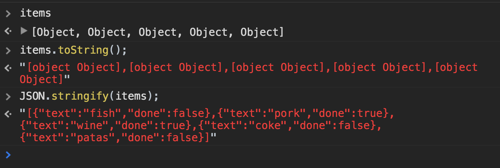

### Update the view part

use `populateList()` this way is much more resilient than just reaching outside the items and grabbing them the place where we will dump them

- the `populateList()` needs two things:
  - a list of plates to populateList: `plates = []`
     - don't forget to set the default `plates` as an empty array(or object), otherwise it will break up the javascript sometimes (in this case the `plates` is an array)
  - a place to put the HTML: `plateList`

```
function populateList(plates = [], plateList) {
  plateList.innerHTML = plates.map((plate, i) => {
    return `
      <li>
        <input type="checkbox" data-index=${i} id="item${i}" ${plate.done ? 'checked' : ''}>
        <label for="item${i}">${plate.text}</label>
      </li>
    `
  }).join('');
}
```

here the `.join('')` takes the array (which is `places.map()` made) and turn into a string and then pass it to `innerHTML`

### Toggle the checked status

```
function toggleDone(e) {
  if(!e.target.matches('input')) return;

  const el = e.target;
  const index = el.dataset.index;

  items[index].done = !items[index].done;
  localStorage.setItem ('items', JSON.stringify(items))
  populateList(items, itemsList);
}
```

let's take look

- skip this unless it's an input

```
if(!e.target.matches('input')) return;
```

- flip-floping between true and false

```
items[index].done = !items[index].done;
```

- everytime update will mirror to the localStorage

```
localStorage.setItem ('items', JSON.stringify(items));
```

- update the actual visibility part on html

```
populateList(items, itemsList);
```

### Hook up events and update visibility part on page

```
addItems.addEventListener('submit', addItem);
itemsList.addEventListener('click', toggleDone);
populateList(items, itemsList);
```

### Extended thinking

everytime we create an item, it calls `populateList()` and rerendering the entire list again instead of just update one single line, in this case is OK on performance, but practically just update one single line by using React or other frameworks is more efficient and helpful

# 15 - CSS Text Shadow Mouse Move Effect


### Grab elements and hook up mousemve event

our `mousemove` event hooked up on `hero` element, and we want to do text shadow effect on its text, right in the `h1` tag

```
const hero = document.querySelector('.hero');
const text = hero.querySelector('h1');

hero.addEventListener('mousemove', shadow);
```

### The shadow function

`walk` is defined to calculate the spacings between shadows, the value is more higher, the spacing is more bigger

```
const walk = 500;  // 500px
```

set the `width` and `height` of `hero`

in ES6 syntax

```
const { offsetWidth: width, offsetHeight: height } = hero;
let { offsetX: x, offsetY: y } = e;
```

above code equals in this way:

```
const width = hero.offsetWidth;
const height = hero.offsetHeight;
let x = e.offsetX;
let y = e.offsetY;
```

now we `console.log()` out will see that `this` is `.hero` and `e.target` is `h1`

```
console.log(this, e.target);
```


calculate offset positions

```
if(this !== e.target) {
  x = x + e.target.offsetLeft;
  y = y + e.target.offsetTop;
}

const xWalk = Math.round((x / width * walk) - (walk / 2));
const yWalk = Math.round((y / height * walk) - (walk / 2));
console.log(xWalk, yWalk);
```

log the `xWalk` and `yWalk` out to see the offsets after calculating

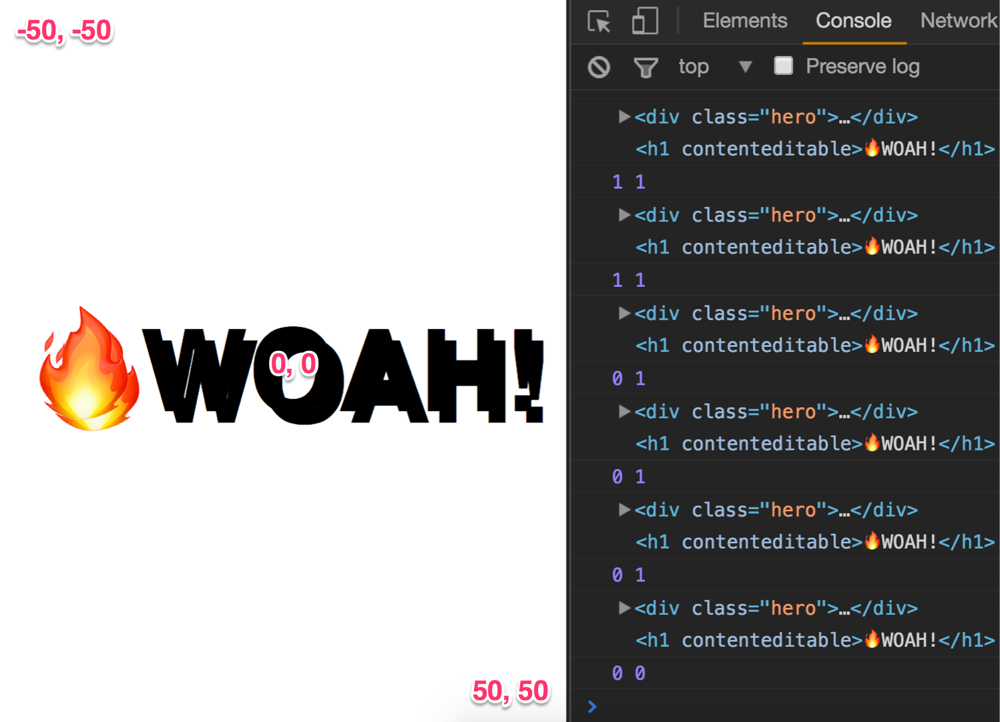

and the CSS part, add the `textShadow` effect

```
text.style.textShadow = `
  ${xWalk}px ${yWalk}px 0 rgba(255, 0, 255, 0.7),
  ${xWalk * -1}px ${yWalk}px 0 rgba(0, 255, 255, 0.6),
  ${yWalk}px ${xWalk * -1}px 0 rgba(0, 255, 0, 0.5),
  ${yWalk * -1}px ${xWalk}px 0 rgba(0, 0, 255, 0.4)
`;
```

### The concepts

- the [`offsetLeft`](https://developer.mozilla.org/en-US/docs/Web/API/HTMLElement/offsetLeft) read-only property returns the number of pixels that the **upper left** corner of the current element is offset to the left within the [`.offsetParent`](https://developer.mozilla.org/en-US/docs/Web/API/HTMLelement/offsetParent) node.

- the [`offsetTop`](https://developer.mozilla.org/en-US/docs/Web/API/HTMLElement/offsetTop) property read-only property returns the distance of the current element relative to the **top** of the [`offsetParent`](https://developer.mozilla.org/en-US/docs/Web/API/HTMLelement/offsetParent) node.

# 16 - Sorting Without Articles


### Sort datas

write in just one hot line

```
const sortedBands = bands.sort((a, b) => strip(a) > strip(b) ? 1 : -1);
```

equals

```
if(strip(a) > strip(b)) {
  return 1;
} else {
  return -1;
}
```

by default, it will sort by alphabetical order

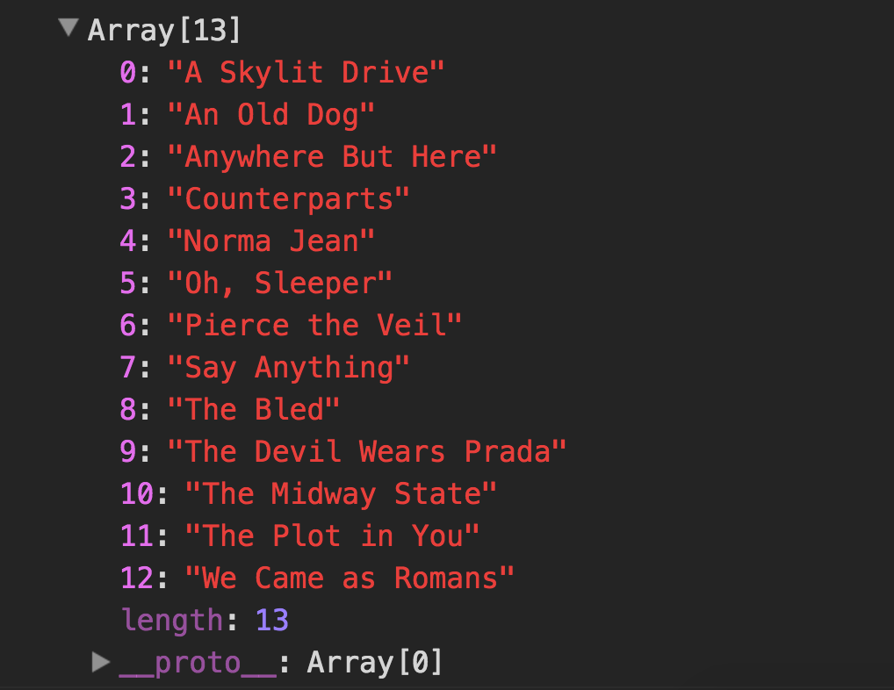

### Strip out the words that we don't want

to strip out the specified words which are not articles

```
function strip(bandName) {
  return bandName.replace(/^(a |the |an )/i, '').trim();
}
```
test it to see if it works

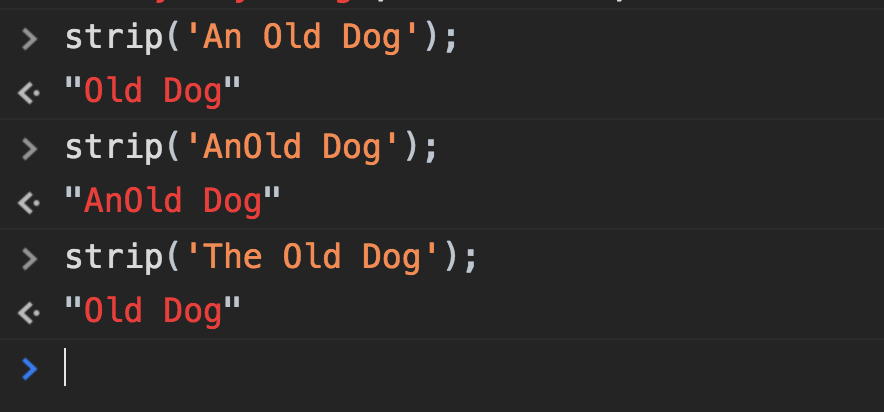

**[NOTICE]** we are only using `strip()` in if statement, and we are not actually going to be modify our data (it's not neccessary to do so)

then now it's sorted by alphabetical order after `strip()` the array


### Put them together

```
document.querySelector('#bands').innerHTML =
  sortedBands
    .map(band => `<li>${band}</li>`)
    .join('');
```

it takes the element and sets to the `innerHTML`, and that's going to return an array with commas (`,`) by default, so we want to `join('')` it into one big string rather than a bunch of string with with a comma in between

if without `join('')`:


so we need to 'join('')' to remove commas:


# 17 - Adding Up Times with Reduce

### Grabing times

don't forget to turn the nodeList into an array

```
const timeNodes = [...document.querySelectorAll('[data-time]')];
```

### Calcualting Times

get the `dataset.time`

```
const seconds = timeNodes
  .map(timeNode => timeNode.dataset.time)

console.log(seconds);
```

will be value of `data-time` attributes we set on html


then we turn the values to seconds unit, and use `parseFloat` to turn it to an actual number of array

```
const seconds = timeNodes
  .map(timeNode => timeNode.dataset.time)
  .map(timeCode => {
    const [mins, secs] = timeCode.split(':').map(parseFloat);
    return (mins * 60) + secs;
  })

console.log(seconds);
```


The [`parseFloat`](https://developer.mozilla.org/en-US/docs/Web/JavaScript/Reference/Global_Objects/parseFloat) function parses a string argument and returns a floating point number.

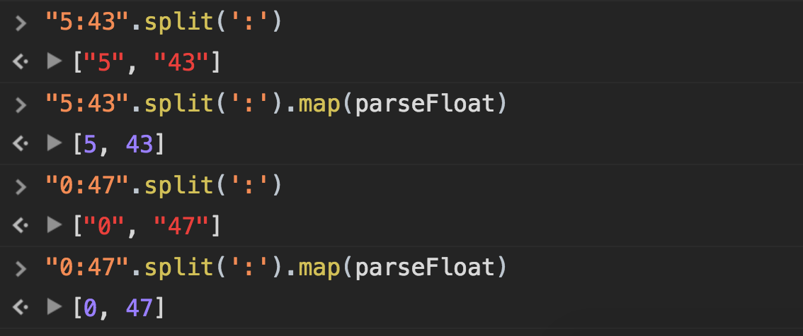

finally, let's `reduce` the array to get the total seconds

```
const seconds = timeNodes
  .map(timeNode => timeNode.dataset.time)
  .map(timeCode => {
    const [mins, secs] = timeCode.split(':').map(parseFloat);
    return (mins * 60) + secs;
  })
  .reduce((total, vidSeconds) => total + vidSeconds);    // total seconds 17938

console.log(seconds);
```

### Figure out the total time

use the `seconds` (total seconds) variable to calculate the `hours` and `mins`, use `Math.floor` to remove decimal point

```
let secondsLeft = seconds;
const hours = Math.floor(secondsLeft / 3600);
secondsLeft = secondsLeft % 3600;

const mins = Math.floor(secondsLeft / 60);
secondsLeft = secondsLeft % 60;
```
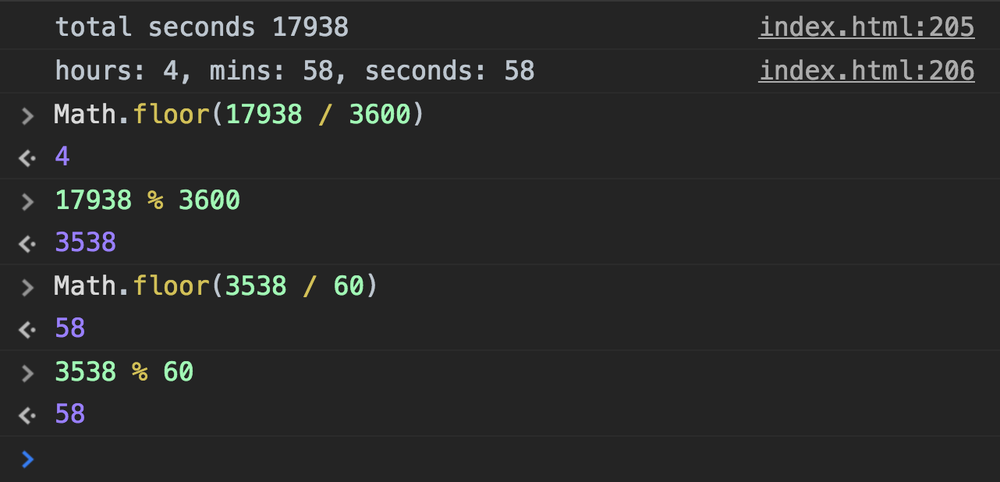

### Visual part

I add a `<h1>` tag to place the result total time

```
const totalTime = document.querySelector('.total');

totalTime.innerHTML = `<span>Total time <b>${hours}</b>:<b>${mins}</b>:<b>${secondsLeft}</span>`;
```

# 18 - Webcam

for accessing our webcam which is must be tied to *secure origin* means that a website is `HTTPS`, and `localhost` in our tutorial is also a secure origin. we use `npm` (`npm install` & `npm start`) to run our small server to build the page.

### To `querySelector` elements we need

```
const video = document.querySelector('.player');
const canvas = document.querySelector('.photo');
const ctx = canvas.getContext('2d');
const strip = document.querySelector('.strip');
const snap = document.querySelector('.snap');
```

### The `getVideo()` function

first of all, we need to get the real video source

```
function getVideo() {
  navigator.mediaDevices.getUserMedia({ video: true, audio: false })
    .then(localMediaStream => {
      console.log(localMediaStream);
      video.srcObject = localMediaStream;
      video.play();
    })
    .catch(err => {
      console.error(`OH NO!!!`, err);
    });
}

```

the `.catch` is to handle the error.

check out the HTML page and you will see that the `video`'s `src` is a `blob:http://XXX`. `blob` means a *raw data* being piped in off this webcam right on the page.


### The `paintToCanavas()` function

take a frame from video (on the upper-right corner), and to paint it onto the actual canvas right on the page

```
function paintToCanavas() {
  const width = video.videoWidth;
  const height = video.videoHeight;
  canvas.width = width;
  canvas.height = height;

  return setInterval(() => {
    ctx.drawImage(video, 0, 0, width, height);
    // take the pixels out
    let pixels = ctx.getImageData(0, 0, width, height);

    // try some effects
    // pixels = redEffect(pixels);

    pixels = rgbSplit(pixels);
    // ctx.globalAlpha = 0.8;

    // pixels = greenScreen(pixels);
    // put them back
    ctx.putImageData(pixels, 0, 0);
  }, 16);
}
```

make sure the canvas width and height equals webcam's width and height to properly rendering

```
const width = video.videoWidth;
const height = video.videoHeight;
canvas.width = width;
canvas.height = height;
```

### The `takePhoto()` function

```
function takePhoto() {
  // played the sound
  snap.currentTime = 0;
  snap.play();

  // take the data out of the canvas
  const data = canvas.toDataURL('image/jpeg');
  const link = document.createElement('a');
  link.href = data;
  link.setAttribute('download', 'handsome');
  link.innerHTML = ``;
  strip.insertBefore(link, strip.firsChild);
}
```

finally, basic webcam just done!

```
getVideo();

video.addEventListener('canplay', paintToCanvas);
```

# 19 - Native Speech Recognition

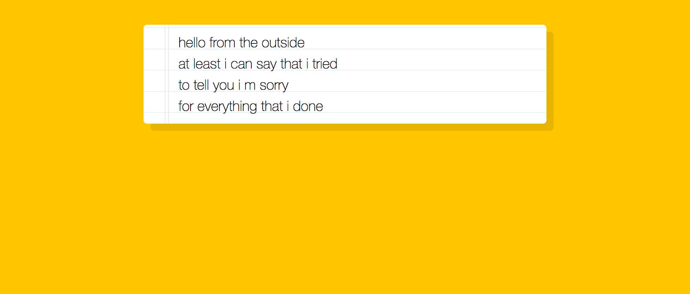

### The `SpeechRecognition`

```
window.SpeechRecognition = window.SpeechRecognition || window.webkitSpeechRecognition;

const recognition = new SpeechRecognition();
recognition.interimResults = true;
```
- [`window.SpeechRecognition`](https://developer.mozilla.org/en-US/docs/Web/API/SpeechRecognition) is a `Web Speech API`.

- `recognition.interimResults = true;` makes sure that results are available while we are speaking

```
let p = document.createElement('p');
const words = document.querySelector('.words');
words.appendChild(p);
```
- use `document.createElement` to create a paragraph and `append` it to the `.words` div

### Add transcripts

```
recognition.addEventListener('result', e => {
  const transcript = Array.from(e.results)
    .map(result => result[0])
    .map(result => result.transcript)
    .join('');

    const poopScript = transcript.replace(/poop|poo|shit|dump/gi, '💩');
    p.textContent = poopScript;

    if (e.results[0].isFinal) {
      p = document.createElement('p');
      words.appendChild(p);
    }
});

recognition.addEventListener('end', recognition.start);

recognition.start();
```

- add an `eventListener` on `result` event of SpeechRecognition, in the event we will get `e.results` and assign to the `transcript` variable.

- `e.results` is a list **NOT** an array

- each `0th` element of the list is the text data we need, so we have to `map` transcript on `result[0]`

- return `transcript` and `join` everything so that it forms a single string.

- this only works for one paragraph so we need to set `recognition.addEventListener('end', recognition.start)` again

- to avoid the `<p>` get replaced in the DOM, we need to run `createElement` and `appendChild` inside the `result` event again so that it creates a new paragraph instead.


# 20 - Geolocation based Speedometer and Compass

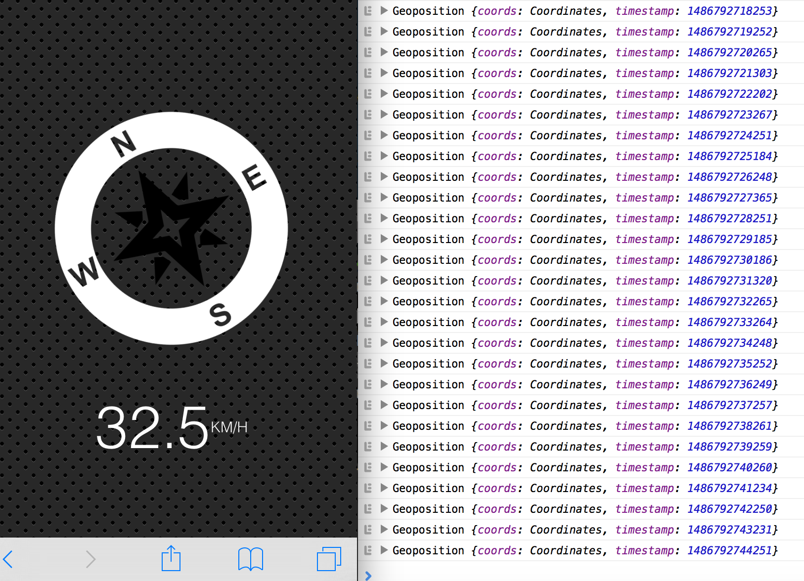

### Basic Geolocation

The [`Geolocation.watchPosition()`](https://developer.mozilla.org/en-US/docs/Web/API/Geolocation/watchPosition) method is used to register a handler function that will be called automatically each time the position of the device changes. You can also, optionally, specify an error handling callback function.

```
const arrow = document.querySelector('.arrow');
const speed = document.querySelector('.speed-value');

navigator.geolocation.watchPosition((data) => {
  // success callback
  // console.log(data);
  speed.textContent = data.coords.speed;
  arrow.style.transform = `rotate(${data.coords.heading}deg)`;
  // error callback
}, (err) => {
  console.log(err);
  alert('Oh NO...you gotta allow that to happen!!');
});
```

##### success

```
function(data) {
  speed.textContent = data.coords.speed;
  arrow.style.transform = `rotate(${data.coords.heading}deg)`;
}
```

##### error

```
function(err) {
  console.log(err);
  alert('Oh NO...you gotta allow that to happen!!');
}
```


# 21 - Follow Along Links


### To `createElement()` and `append()` it on to the DOM

```
const triggers = document.querySelectorAll('a');
const highlight = document.createElement('span');

highlight.classList.add('highlight');
document.body.append(highlight);
```

### The `highlightLink()` function

```
function highlightLink() {
  const linkCoordinates = this.getBoundingClientRect();
  // console.log(this);  // <a> itself
  console.log(linkCoords);

  const coordinates = {
    width: linkCoordinates.width,
    height: linkCoordinates.height,
    top: linkCoordinates.top + window.scrollY,
    left: linkCoordinates.left + window.scrollX
  };

  highlight.style.width =`${coordinates.width}px`;
  highlight.style.height =`${coordinates.height}px`;
  highlight.style.transform = `translate(${coordinates.left}px, ${coordinates.top}px)`;
}

triggers.forEach(a => a.addEventListener('mouseenter', highlightLink));
```

**[NOTE]** need to add `window.scrollX` and `window.scrollX` to prevent wrong position while scroll occured

```
top: linkCoords.top + window.scrollY,
left: linkCoords.left + window.scrollX
```

- `this`: every single `<a>` element itself
- to `console.log(linkCoords);` will get


we can see what we have here

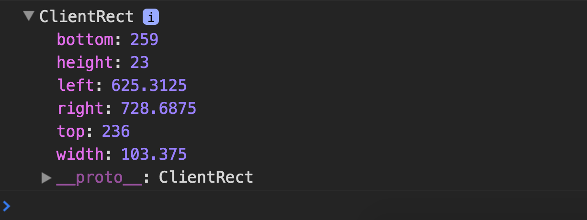

### Set a initial start corrdinates

because we don't want it "slide" in from the `(X,Y) = (0,0)` of window's coordinates, so let's set it start from the first `<li>` element of `<nav>`

```
const initStart = {
  left: initCoord.left + window.scrollX,
  top: initCoord.top + window.scrollY
};

highlight.style.transform = `translate(${initStart.left}px, ${initStart.top}px)`;
```

# 22 - Speech Synthesis


### Set up elements

```
const message = new SpeechSynthesisUtterance();
let voices = [];
const voicesDropdown = document.querySelector('[name="voice"]');
const options = document.querySelectorAll('[type="range"], [name="text"]');
const speakButton = document.querySelector('#speak');
const stopButton = document.querySelector('#stop');
message.text = document.querySelector('[name="text"]').value;
```

### The `populateVoices()` function

```
function populateVoices() {
  voices = this.getVoices();  // get all the voices
  console.log(voices);

  // select dropdown
  voicesDropdown.innerHTML = voices
    // only want en ver. voices
    .filter(voice => voice.lang.includes('en'))
    .map(voice => `<option value="${voice.name}">${voice.name} (${voice.lang})</option>`)
    .join('');
}
```

- to `console.log(voices)` will get all the voice synthesis

```
voices = this.getVoices();
console.log(voices);
```


- for select dropdown

because we only want just english versions so we `filter` array with `includes()`

```
voicesDropdown.innerHTML = voices
  .filter(voice => voice.lang.includes('en'))
  .map(voice => `<option value="${voice.name}">${voice.name} (${voice.lang})</option>`)
  .join('');
```

### The `setVoice()` function

set the voice equals the value of select option

```
function setVoice() {
  msg.voice = voices.find(voice => voice.name === this.value);
  toggle();
}
```

### The `toggle()` function

change voice while talking, and don't forget to call this function in `setVoice()` and `setOption()`

```
function toggle(startOver = true) {
  speechSynthesis.cancel();
  if (startOver) {
    speechSynthesis.speak(message);
  }
}
```

### The `setOption()` function

change the value of `Rate`, `Pitch` options and `textarea`

```
function setOption() {
  console.log(this.name, this.value);
  message[this.name] = this.value;
  toggle();
}
```

### Hook up events

```
speechSynthesis.addEventListener('voiceschanged', populateVoices);
voicesDropdown.addEventListener('change', setVoice);
options.forEach(option => option.addEventListener('change', setOption));
speakButton.addEventListener('click', toggle);
stopButton.addEventListener('click', () => toggle(false));
```

# 23 - Sticky Nav


### Get the position of nav

get nav's top position related to the top of window

```
const nav = document.querySelector('#main');
const topOfNav = nav.offsetTop;  // 320
```

### The `fixNav()` function

```
function fixNav() {
  if (window.scrollY >= topOfNav) {
    document.body.style.paddingTop = `${nav.offsetHeight}px`;  // 77px (nav's height)
    nav.classList.add('fixed-nav');
  } else {
    document.body.style.paddingTop = 0;
    nav.classList.remove('fixed-nav');
  }
}

window.addEventListener('scroll', fixNav);
```

# 24 - Event Capture, Propagation, Bubbling and Once.


`e.stopPropagation()`, `capture`, `once`

### The `event.stopPropagation()`

The [`event.stopPropagation()`](https://developer.mozilla.org/en-US/docs/Web/API/Event/stopPropagation) prevents further propagation of the current event in the capturing and bubbling phases.

To bubble up which means that it's triggering that events as you go up, so use `e.stopPropagation();` to stop bubbling that event up.

```
function logText(e) {
  console.log(this.classList.value);
  e.stopPropagation();
}

document.body.addEventListener('click', logText);
divs.forEach(div => div.addEventListener('click', logText));
```

- if we don't set `e.stopPropagation();` and `console.log(this.classList.value);` will get when we click on just the "three" `<div>`


### The `capture` and `once`

refernce: [here -> EventTarget.addEventListener()](https://developer.mozilla.org/en-US/docs/Web/API/EventTarget/addEventListener)

##### `capture`

`capture` is a boolean that indicates that events of this type will be dispatched to the registered listener before being dispatched to any EventTarget beneath it in the DOM tree.

```
function logText(e) {
  console.log(this.classList.value);
}

divs.forEach(div => div.addEventListener('click', logText, {
  capture: false
}));
```

- set `capture` is `true` or `false` **without** setting `e.stopPropagation();`


##### `once`

`once` is a boolean indicating that the listener should be invoked at most once after being added. **If it is true, the listener would be removed automatically when it is invoked**.

```
button.addEventListener('click', () => {
  console.log('Click!!!');
}, {
  once: false
});
```

- set `once` is `ture` or `false` and click **multiple** times

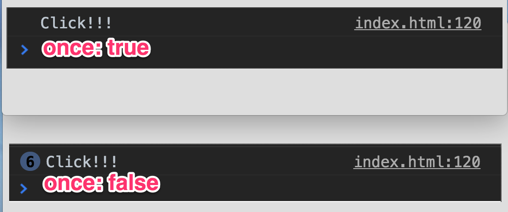

# 25 - Stripe (Follow Along) Nav


### The `handleEnter()` function

```
function handleEnter() {
  this.classList.add('trigger-enter');
  setTimeout(() => this.classList.contains('trigger-enter') && this.classList.add('trigger-enter-active'), 150);

  background.classList.add('open');

  const dropdown = this.querySelector('.dropdown');
  const dropdownCoords = dropdown.getBoundingClientRect();
  const navCoords = nav.getBoundingClientRect();

  const coords = {
    height: dropdownCoords.height,
    width: dropdownCoords.width,
    top: dropdownCoords.top - navCoords.top,
    left: dropdownCoords.left - navCoords.left
  };

  background.style.setProperty('width', `${coords.width}px`);
  background.style.setProperty('height', `${coords.height}px`);
  background.style.setProperty('transform', `translate(${coords.left}px, ${coords.top}px)`);
}
```

- the `setTimeout()` here is if has `trigger-enter` class and it equals true then will excute `this.classList.add('trigger-enter-active')` , it will prevent the weird `trigger-enter-active` when you hover quickly between li items

```
setTimeout(() => this.classList.contains('trigger-enter') && this.classList.add('trigger-enter-active'), 150);
```

above code use ES6 arrow function to properly inherit from it's parent instead, otherwise `this` will be the `window` and will throut an error

- figure out the nav's position as a initial coords
```
const navCoords = nav.getBoundingClientRect();
```
- to prevent wrong position when the nav has be pushed down or moved offset on X-asis, so `- navCoords.`top/left

```
top: dropdownCoords.top - navCoords.top,
left: dropdownCoords.left - navCoords.left
```

### The `handleLeave()` function

```
function handleLeave() {
  this.classList.remove('trigger-enter', 'trigger-enter-active');
  background.classList.remove('open');
}
```

### Hook up events

```
triggers.forEach(trigger => trigger.addEventListener('mouseenter', handleEnter));
triggers.forEach(trigger => trigger.addEventListener('mouseleave', handleLeave));
```

# 26 - Click and Drag to Scroll


### Define variables we need

```
const slider = document.querySelector('.items');
let isDown = false;
let startX;
let scrollLeft;
```

- `isDown`: mouse is clicked down or not
- `startX`: start point from the slider
- `scrollLeft`: store slider's scrollLeft when scroll occured

### The `mousedown()` function

1. set the `isDown` is `true`
2. add `active` class to the `slider`
3. get the start point when mousedown
4. get the previous `scrollLeft` if scrolled

```
slider.addEventListener('mousedown', (e) => {
  isDown = true;
  slider.classList.add('active');
  startX = e.pageX - slider.offsetLeft;
  scrollLeft = slider.scrollLeft;
});
```

- `isDown`: set `true` when mouse down
- `startX = e.pageX - slider.offsetLeft;`: prevent the initial start point of slider isn't start from 0 (`offsetLeft`) of page (maybe there is padding or margin around the slider), so we need to subtract the value of `slider.offsetLeft` to get the real point of position

### The `mouseleave()` function

1. set `isDown` back to `false`
2. remove the `active` classList

```
slider.addEventListener('mouseleave', () => {
  isDown = false;
  slider.classList.remove('active');
});
```

### The `mouseup()` function

1. set `isDown` back to `false`
2. remove the `active` classList

same as `mouseleave()`

```
slider.addEventListener('mouseup', () => {
  isDown = false;
  slider.classList.remove('active');
});
```

### The `mousemove()` function

the important part

```
slider.addEventListener('mousemove', (e) => {
  if(!isDown) return;
  e.preventDefault();
  const x = e.pageX - slider.offsetLeft;
  const walk = (x - startX) * 3;
  // slider.scrollLeft = walk;
  slider.scrollLeft = scrollLeft - walk;
```

- `if(!isDown) return;`: stop the function from running if not mouse down
- `e.preventDefault();`: stop the browser think that we might want to select text

small details:

- `const walk = (x - startX) * 3;`: how far we deviated from the initial point, and add with `* 3` (px) to make slider scroll smoothly

```
  // slider.scrollLeft = walk;
  slider.scrollLeft = scrollLeft - walk;
```

`slider.scrollLeft = walk;` seems work but still jumpy, so recalculating like
`slider.scrollLeft = scrollLeft -walk;` every single time can fix this jumpy.

# 27 - Video Speed Controller

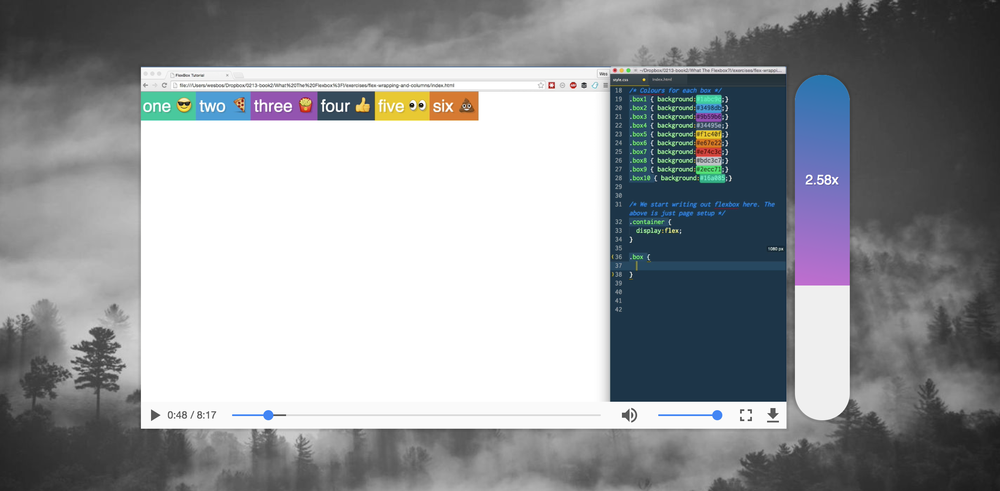

### Handle Speed function

```
function handleSpeed(e) {
  const y = e.pageY - this.offsetTop;
  const percent = y / this.offsetHeight;
  const min = 0.4;
  const max = 4;
  const height = Math.round(percent * 100) + '%';
  const playbackRate = percent * (max - min) + min;
  bar.style.height = height;
  bar.textContent = playbackRate.toFixed(2) + 'x';
  video.playbackRate = playbackRate;
}
```

- `y = e.pageY - this.offsetTop;`: take the offset at which the top of the parent is, and subtract the offset from the y coordinate, which gives us just how much of the bar is to be filled
- `percent = y / this.offsetHeight;`: calculate the height(%), divide Y by the total height of the parent, `y/offsetHeight` will give us the decimal %

```
const min = 0.4;
const max = 4;
const height = Math.round(percent * 100) + '%';
```

- define the boundaries of `min` and `max` our own, and multiply by 100 and get how much % of space is to be filled by `speed-bar`.

```
const playbackRate = percent * (max - min) + min;
```

- find the number associated with that much height and use it as playback rate. at 0 height should be 0.4, and at 100 height it should be 2.5, so we do `percent * (max - min) + min` to match it, and assig it to `video.playbackRate`

- `toFixed(2);` displays the number with 2 decimal places

# 28 - Countdown Timer


### The `timer()` function

```
let countdown;
const timerDisplay = document.querySelector('.display__time-left');
const endTime = document.querySelector('.display__end-time');
const buttons = document.querySelectorAll('[data-time]');
```

```
function timer(seconds) {
  clearInterval(countdown);

  const now = Date.now();
  const then = now + seconds * 1000;

  displayTimeLeft(seconds);
  displayEndTime(then);

  countdown = setInterval(() => {
    const secondsLeft = Math.round((then - Date.now()) / 1000);

    // check if we should stop it
    if (secondsLeft < 0) {
      clearInterval(countdown);
      return;
    }

    // display it
    // console.log(secondsLeft);
    displayTimeLeft(secondsLeft);
  }, 1000);
}
```

- `clearInterval(countdown);`: when start a timer, clear existing timers, and it always **needs a variable name of a `setInterval()`** to stop it.
- remember to `clearInterval()` the timer at the **beginning** of the timer function.
- `const now = Date.now();`: will get us current `timestamp` in milliseconds
- `const then = now + seconds * 1000;`: `now` plus the number of seconds that you wish to run the timer for. `now` is in milliseconds, but `seconds` is not, so we need to multiple by 1000 to be in milliseconds as well

```
countdown = setInterval(() => {
  const secondsLeft = Math.round((then - Date.now()) / 1000);
  // check if we should stop it
  if (secondsLeft < 0) {
    clearInterval(countdown);
    return;
  }

  // display it
  displayTimeLeft(secondsLeft);
}, 1000);
```

- `setInterval()` does not run immediately, it needs 1 second to start

- **[NOTICE]** we can't use like:

```
setInterval(seconds, {
  seconds—;
});
```

because sometimes when the browser is not active, it might pause the `setInterval()`, and also pauses while scrolling in iOS.

### The `displayTimeLeft()` function

```
function displayTimeLeft(seconds) {
  const minutes = Math.floor(seconds / 60);
  const remainderSeconds = seconds % 60;
  const display = `${minutes}:${remainderSeconds < 10 ? '0' : ''}${remainderSeconds}`;

  document.title = display;
  timerDisplay.textContent = display;
}
```

- use `textContent` over `innerText`. `innerText` is IE specific and does not cover all elements
- `document.title = display;`: `document.title` can be dynamically set in JS, it updates the title of the webpage(the `<title>` tag on HTML) like:


### The `displayEndTime()` function

```
function displayEndTime(timestamp) {
  const end = new Date(timestamp);
  const hour = end.getHours();
  const adjustedHour = hour > 12 ? hour - 12 : hour;
  const minutes = end.getMinutes();
  endTime.textContent = `Be Back At ${adjustedHour}:${minutes < 10 ? '0' : ''}${minutes}`;
}
```

- `const adjustedHour = hour > 12 ? hour - 12 : hour;`: adjust the time format as in 12-hours instead of 24-hours

### The `startTimer()` function

```
function startTimer() {
  const seconds = parseInt(this.dataset.time);
  timer(seconds);
}
```

- `const seconds = parseInt(this.dataset.time);`: change the value of `data-time` attribute (`dataset`) of an element into a real number (say from `"20"` into `20`) by `parseInt()`

### Hook up events

```
buttons.forEach(button => button.addEventListener('click', startTimer));

document.customForm.addEventListener('submit', function(e) {
  e.preventDefault();
  const mins = this.minutes.value;
  timer(mins * 60);
  this.reset();  // clear form input value
});
```

- **[NOTICE]** we can directly select as `document.elementName` if an element has a `name attribute` in the DOM of HTML (in this case is `document.customForm`, the `customForm` is a `name attribute` of `<form>` element)
- `this.reset();`: clear form input value (`this` is the `form`)

# 29 - Whack A Mole


### Set up things

```
const holes = document.querySelectorAll('.hole');
const scoreBoard = document.querySelector('.score');
const moles = document.querySelectorAll('.mole');

let lastHole;
let timeUp = false;
let score = 0;
```

### The `randomTime()` function

```
function randomTime(min, max) {
  return Math.round(Math.random() * (max - min) + min);
}
```

The [`Math.random(min, max)`](https://developer.mozilla.org/en-US/docs/Web/JavaScript/Reference/Global_Objects/Math/random) function returns a floating-point, pseudo-random number in the range (0, 1) that is, from 0 (inclusive) up to but not including 1 (exclusive), which you can then scale to your desired range.

- the final `+ min` ensures that the minimum possible value if the difference between max and min is 0, will be the min value itself, so it basically offsets the value of max-min by the value of min itself, then we can get a valid number.

### The `randomHole(holes)` function

```
function randomHole(holes) {
  const idx = Math.floor(Math.random() * holes.length);
  const hole = holes[idx];
  if (hole === lastHole) {
    console.log("Ah that is the same one bud");
    return randomHole(holes);
  }

  lastHole = hole;
  return hole;
}
```

- randomly defines the hole to pop up mole.
- if the `hole === lastHole` then re-execute the function again

```
if (hole === lastHole) {
  console.log("Ah that is the same one bud");
  return randomHole(holes);
}

lastHole = hole;
```

### The `peep()` function

```
function peep() {
  const time = randomTime(200, 1000);
  const hole = randomHole(holes);
  hole.classList.add('up');

  setTimeout(() => {
    hole.classList.remove('up');
    if(!timeUp) peep();
  }, time);
}
```

- `setTimeout()` to remove the `up` class if time up, otherwise keep `peep()`ing

### The `startGame()` function

on HTML

```
<button onClick="startGame()">START</button>
```

```
function startGame() {
  scoreBoard.textContent = 0;
  timeUp = false; // in case page reload
  score = 0;
  peep();

  setTimeout(() => timeUp = true, 10000);
}
```

- define the game time which is 10 secs and set the `timeUp = true`

### The `bonk(e)` function

```
function bonk(e) {
  if(!e.isTrusted) return; // cheater
  score ++;
  this.classList.remove('up');
  scoreBoard.textContent = score;
}

moles.forEach(mole => mole.addEventListener('click', bonk));
```

- `e.isTrusted` property which can check for fake clicks generated by javascript, in our game we need it to be `true` so that this actually came from the user's mouse input

# Work in progress ?